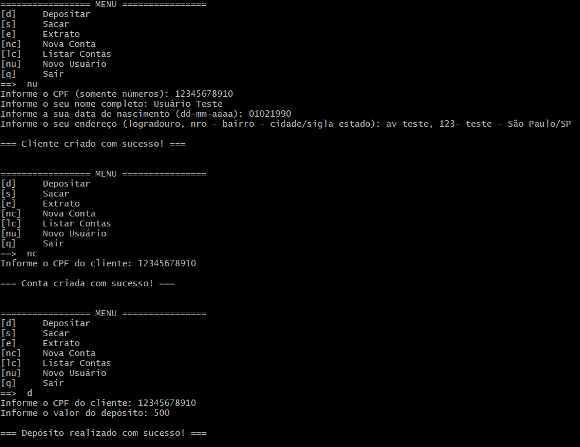
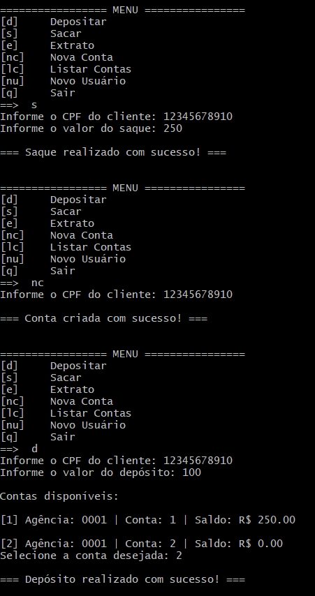
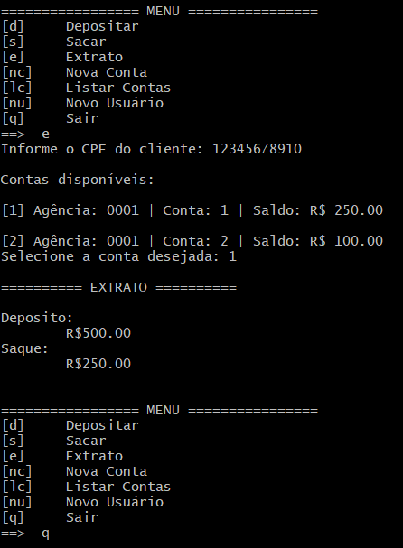

# 💰 Sistema Bancário em POO com Python

Projeto desenvolvido como parte do desafio **"Modelando o Sistema Bancário em POO com Python"** da **DIO (Digital Innovation One)** em parceria com a **Luizalabs**.

O objetivo do desafio é aplicar conceitos de Programação Orientada a Objetos (POO) para modelar um sistema bancário simples via terminal.

---

## 🚀 Melhorias implementadas

Além da implementação base proposta no desafio, foram realizadas melhorias para tornar o código mais organizado, reutilizável e próximo de um cenário real:

- 🔹 Criação da função `obter_cliente` para evitar repetição na validação de CPF  
- 🔹 Padronização das mensagens do sistema com a função `mensagem`  
- 🔹 Separação de responsabilidades (remoção de `print` das classes)  
- 🔹 Retorno de sucesso/erro nas operações (`depositar` e `sacar`)  
- 🔹 Criação da função `ler_valor` para validação de entrada numérica  
- 🔹 Implementação de seleção de conta para clientes com múltiplas contas  
- 🔹 Melhorias na experiência do usuário no terminal (UX)

---

## 🛠️ Tecnologias utilizadas

- Python 3
- Programação Orientada a Objetos (POO)

---

## ▶️ Como executar o projeto

1. Clone o repositório:

```bash
git clone https://github.com/GalvanGabe/sistema-bancario-poo-python.git
```
2. Acesse a pasta do projeto:

```bash
cd sistema-bancario-poo-python
```
3. Execute o arquivo:

```bash
python sistema_bancario.py
```

## 📸 Exemplo de uso

Abaixo um fluxo completo de utilização do sistema:

- Criação de usuário  
- Criação de conta  
- Depósito  
- Saque  
- Criação de segunda conta  
- Novo depósito  
- Consulta de extrato





## 📚 Código base do professor

O projeto foi desenvolvido com base no código disponibilizado durante as aulas:

👉 https://github.com/digitalinnovationone/trilha-python-dio/blob/main/02%20-%20Programa%C3%A7%C3%A3o%20Orientada%20a%20Objetos/10%20-%20desafio/desafio_v2.py

## 📌 Observações

Este projeto tem fins educacionais e faz parte do processo de aprendizado em Python e boas práticas de desenvolvimento.

## 👨‍💻 Autor

Gabriel Galvan
